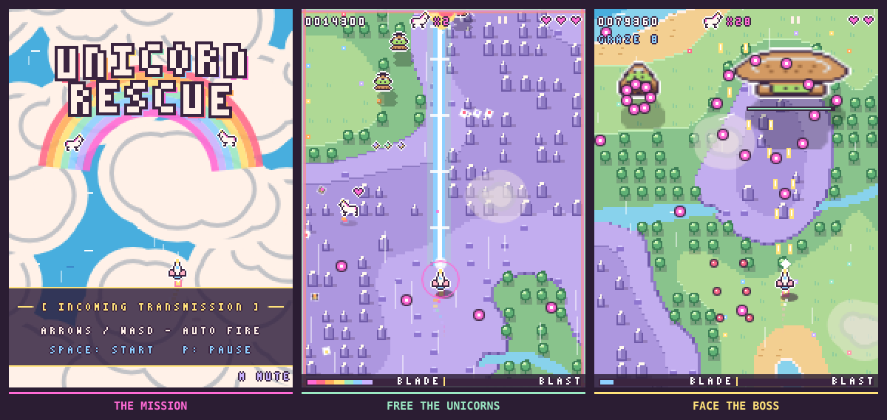
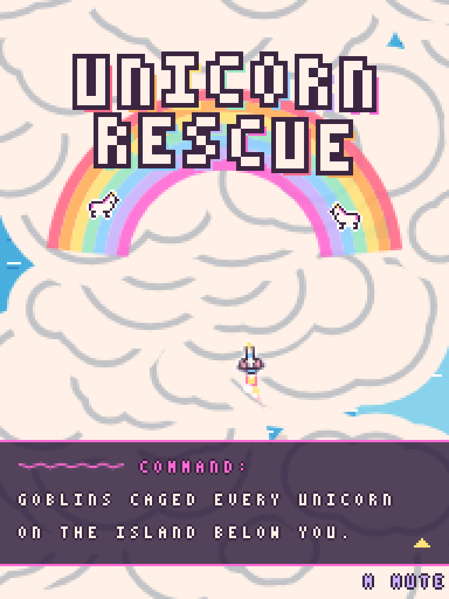
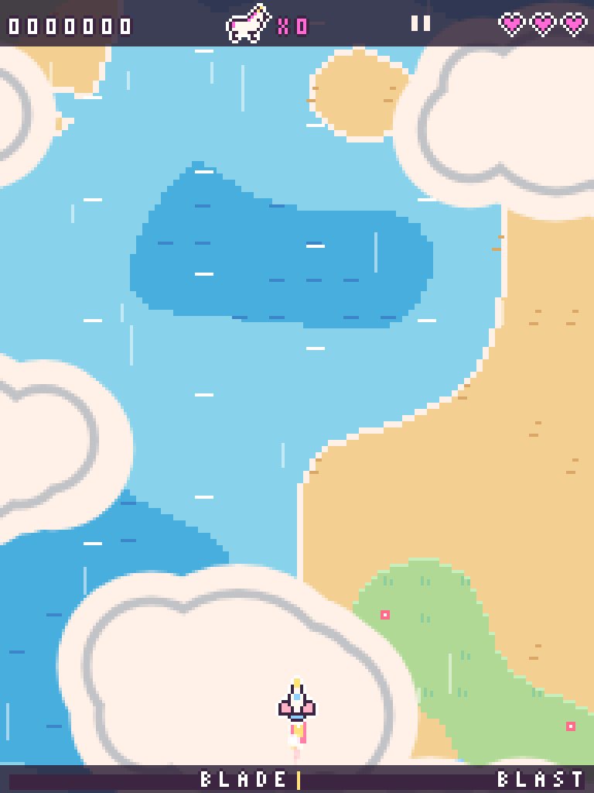
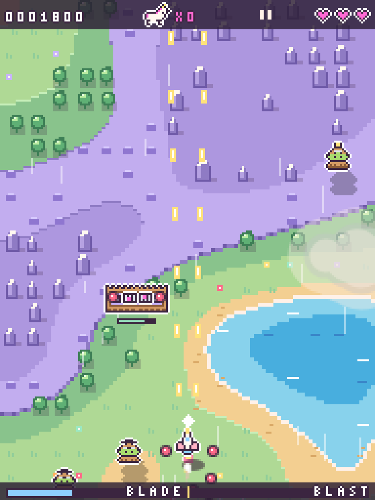
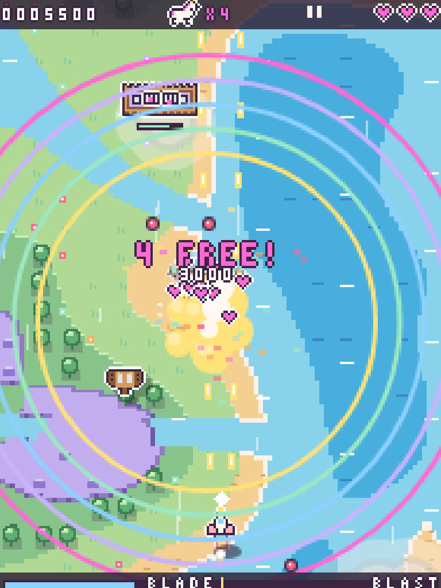
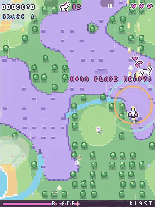
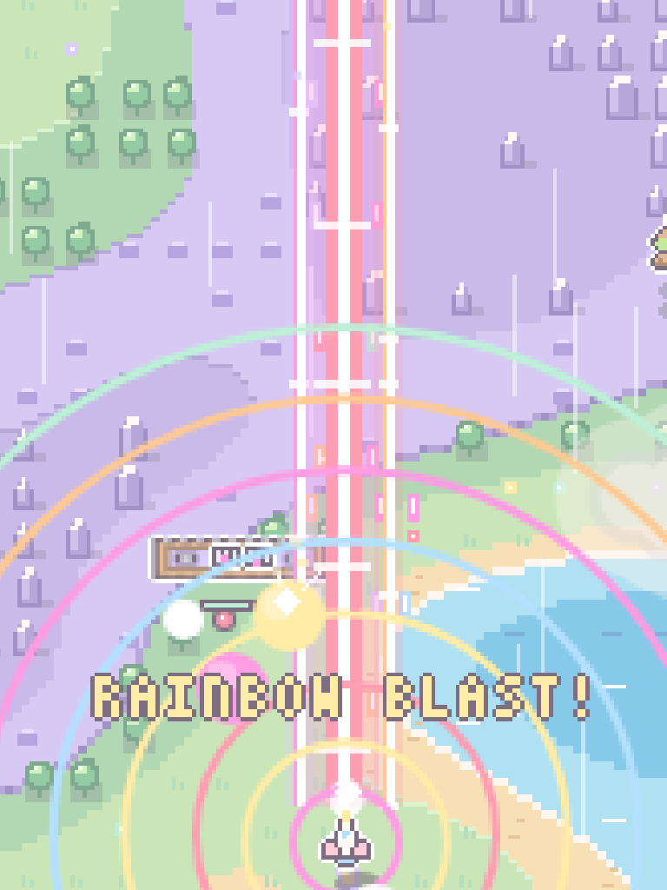

# Unicorn Rescue

**43 unicorns to save. One fighter. A sky that gives you nothing for free.**

A pastel vertical shoot'em up, playable on **desktop and mobile**. Steam-powered
goblins have locked the unicorns away on an island: cross the clouds, break open
the cages and take on their flying fortress. The whole game is generated by code
and fits in a **13 KB** archive, for js13kGames 2026 and its theme
*Unicorns and Rainbows*.



[The game](#the-game) · [Controls](#controls) · [Tech and build](#tech-and-build) · [Wavedash](#wavedash)

## The game

### Briefing and descent

A radio transmission sets the mission. Press `Space` or tap the screen to advance
through the briefing. The fighter then dives through the clouds: the island rises
out of the ocean, the scenery reveals itself and automatic fire starts on arrival
in the combat zone.

| The mission | Arriving on the island |
|:---:|:---:|
|  |  |

### Survive the waves, open the cages

Squadrons come in waves, backed by turrets and armored vehicles on the ground.
Fire is automatic: focus on your path, the bullets to dodge and the targets to
take down. Destroy the prisons to watch the unicorns fly off among hearts and
rainbows.

The score rewards boldness. Destroying an enemy up close multiplies the points
up to **×4** and drops more stars. Chain destructions to keep the combo going;
grazing projectiles also raises the score and the power gauge. You decide when
to close in and when to back off.

| Fighting over the island | Freeing the unicorns |
|:---:|:---:|
|  |  |

### Two powers, a single button

**Horn Blade**, available at half gauge, replaces your projectiles with a
continuous beam that pierces through enemies. **Rainbow Blast**, at full gauge,
adds two side beams and a five-way shot; enemy bullets caught in its beams turn
into stars. Trigger them with `Space` or the touch button: the amount of charge
decides which power you get.

| Horn Blade in action | Rainbow Blast |
|:---:|:---:|
|  |  |

Each activation grants three seconds of invulnerability. And if a bullet catches
you off guard, a short last-chance window still lets you trigger a charged power
to avoid losing a life. The three hearts are your three lives; when they run out,
the game is over.

### Mini-bosses and the flying fortress

Tougher armored vehicles punctuate the crossing before the final airship arrives,
shown on the right of the triptych at the top of this page. Its bursts of
projectiles and its reinforcements demand room to dodge while you look for
openings to attack.

Defeating the boss wins the game. Coming back with **all 43 unicorns** is the
ultimate goal; the final score gives you a reason to try again and take a few
more risks. The best score is kept locally in the browser.

## Controls

| Action | Desktop | Mobile |
|---|---|---|
| Start / advance through the briefing | `Space` | Tap the screen |
| Move | `↑` `↓` `←` `→`, `WASD` or `ZQSD` | Drag a finger |
| Move precisely | Hold `Shift` | Small finger movements |
| Fire | Automatic | Automatic |
| Trigger the charged power | `Space` | Bottom-right button or two fingers |
| Pause | `P` or `Esc` | `II` button |
| Resume | `P`, `Esc` or `Space` | Tap the screen |
| Mute / unmute | `M` | — |

The game pauses when the window loses focus. It adapts its display to the screen
size and to orientation changes.

To play locally, open [src/index.html](src/index.html) directly. To play the
release version, build the project then open `dist/js13k/index.html`, or extract
`js13k-game.zip` and open its `index.html`.

## Tech and build

### Building both versions

Requirements: **Node.js 20 or later**, npm, `zip` and `unzip`. Also install
`advzip` to get the final compression used here (`brew install advancecomp`
on macOS).

```bash
npm ci
npm run build
```

A single command produces the three deliverables from the same snapshot of the source:

```text
js13k-game.zip               # contest archive, at the repository root
dist/
  js13k/index.html         # minified HTML, compressed with Roadroller
  wavedash/index.html      # copy of the source, no minification, no Roadroller
```

The ZIP contains only `index.html`, identical to `dist/js13k/index.html`.
`dist/` is entirely generated: it holds nothing but the two targets and is
replaced on every successful build. The files to keep in Git are the source, the
build scripts, `package.json`, the lockfile and `wavedash.toml`, among others;
deliverables and intermediate files are ignored.

### Where the 13 KB are enforced

The limit applies to **the complete ZIP archive: 13,312 bytes**, not to the size
of the source or of the uncompressed HTML. Measured size of the ZIP present on
September 11, 2026: **13,279 bytes**, leaving **33 bytes of headroom**. This
measurement can change with every rebuild.

The check lives in [build.js](build.js), with the constant `LIMIT=13312`:

1. The JavaScript extracted from the HTML goes through a syntax check.
2. Terser applies the options from [build-options.cjs](build-options.cjs), then
   Roadroller compresses the result with eight contexts.
3. Each candidate is zipped, then recompressed with `advzip` if it is installed,
   with 100 iterations. The ZIP integrity and the identity of the extracted HTML are verified.
4. `npm run build` tries three candidates and keeps the smallest. If it exceeds
   the limit, the command fails and keeps the last valid deliverables.

Roadroller's compression search is variable: the figure printed by the build is
authoritative. The screenshots, the GIF, the video, the cover and the thumbnail
stay **outside the game archive**, as do the documentation and the test tools.

For faster iteration, `npm run build:fast` writes a minified version without
Roadroller to `.build/fast/index.html`. The alpha and autopilot variants also
write to `.build/`, without replacing the official deliverables.

### How the game fits in this budget

The game uses **Canvas 2D and Web Audio**, with no game engine and no assets to
download. Sprites are encoded as characters mapped to a palette, the font is
drawn pixel by pixel, and the island is generated then cached. Music and sound
effects are synthesized in the browser.

The simulation advances at 60 steps per second, independently of the rendering
frame rate. Terser strips the development diagnostics and shortens internal
names; an explicit list of private properties preserves the names of browser and
Wavedash APIs. Roadroller then shrinks the size further at the cost of a decoding
step at startup.

### Local checks

After `npm run build`:

```bash
npm run test:build
npm test
npx playwright install chromium firefox
npm run test:browser
npm run test:wavedash
npm run test:wavedash:browser
```

These checks cover the budget, the ZIP contents, the isolation of development
outputs, game regressions and the controls in Chromium and Firefox. The Wavedash
tests use a simulated SDK on the source, the minified code and the delivered
pages; they are no substitute for a test run connected to the platform.

## Wavedash

The integration includes **10 achievements and 3 leaderboards**. The definitions
live in [achievements.json](wavedash/achievements.json) and
[leaderboards.json](wavedash/leaderboards.json).

| Leaderboard | Recorded result |
|---|---|
| High Score | Best score of any completed run, win or loss |
| Fastest Rescue | Fastest win, excluding briefing, descent and pauses |
| Perfect Rescue Score | Best score of a win with all 43 unicorns |

[wavedash.toml](wavedash.toml) holds the game identifier and targets only
`dist/wavedash`, with `index.html` as the entry point. The SDK is injected by the
host. When the SDK is present, the game calls `Wavedash.init()` automatically
so the platform can dismiss its loader. Without the SDK, no platform calls run.
Achievements wait for `requestStats()` to confirm `success` and `data === true`.
Remote definitions and real calls still need to be checked in a connected session.

After changing the source, run `npm run build` before `wavedash dev`: the CLI
serves `dist/wavedash`, not `src/`. Reload the preview after rebuilding. Uploading
an older build keeps its old code, so upload the rebuilt folder for the same fix
on the platform.

The [presentation video](wavedash/wavedash-gameplay.mp4) and the
[cover](media/cover.png), [thumbnail](media/thumbnail.png) and
[triptych](media/gameplay-triptych.png) visuals come with the game. The
[submission text](media/js13k-description.md) is ready to adapt with the public
Wavedash link.

## Credits and license

The game feel draws on **Cattle Crisis** by Krystman (Lazy Devs), on PICO-8:
hitstop, proximity multiplier, magnetic pickups and intro clouds. These
techniques were reimplemented for Unicorn Rescue.

[MIT](LICENSE) license.
